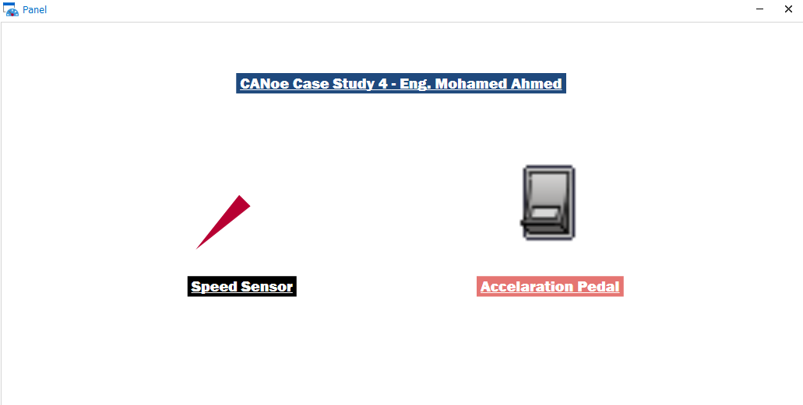
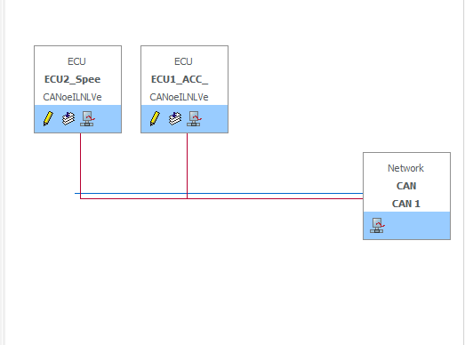
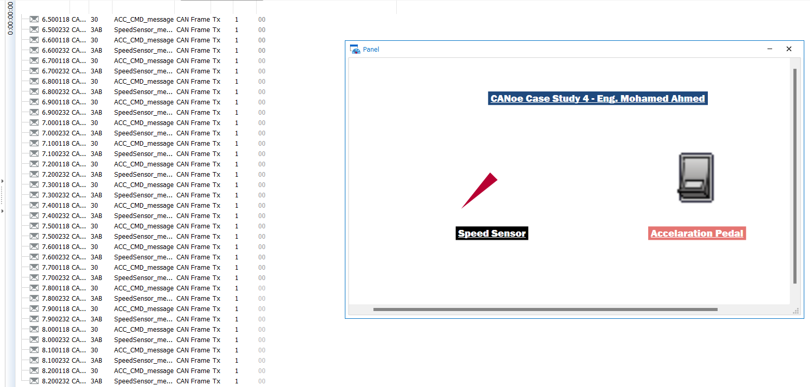
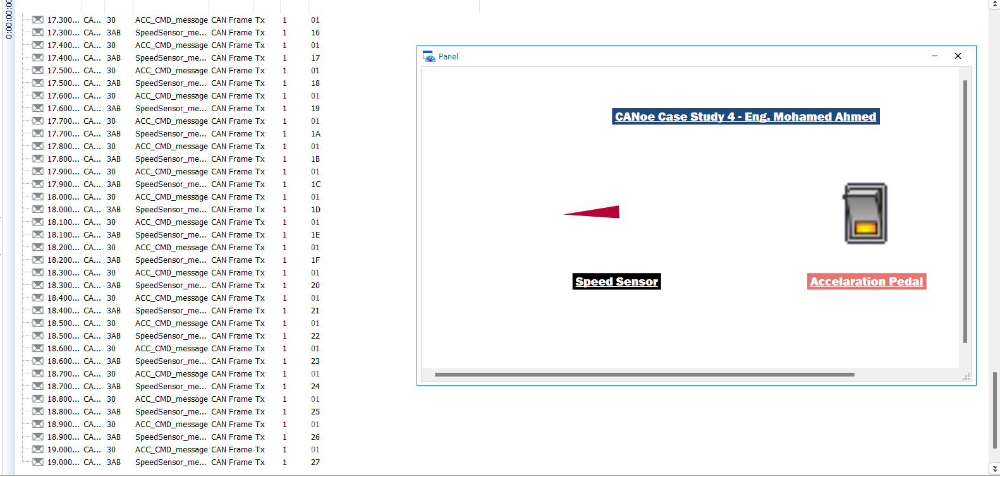
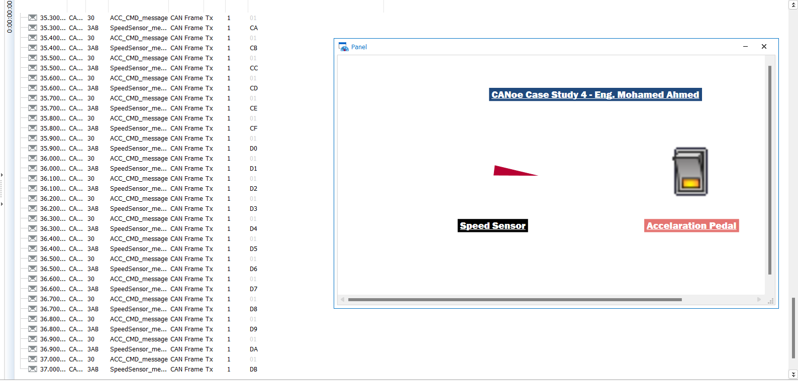
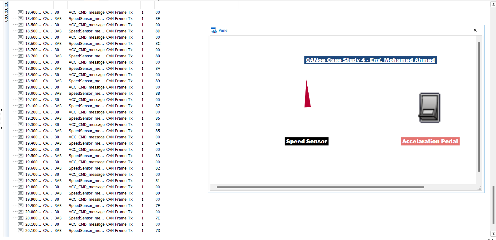

Sure, here is the updated README file without the scripts.

---

# CANoe Case Study 4

This project demonstrates the use of the CAN protocol for communication between two ECUs using the CANoe tool. The first ECU (ECU1) sends an acceleration command every 100 ms, while the second ECU (ECU2) receives this command and increments the speed accordingly from 0 to 255.

## Project Overview

### ECU1
- Sends acceleration command every 100 ms.
- Receives speed sensor messages from ECU2.
- Displays messages on the panel.

### ECU2
- Receives acceleration commands from ECU1.
- Increments or decrements speed based on the received command.
- Sends speed sensor messages to ECU1.
- Updates the speed variable on the panel.

## Screenshots

### Main Panel

### CANoe Configuration

### Tracing When no action taken

### Tracing When Accelaration CMD is On

### Tracing Accelaration CMD still On 

### Tracing When Accelaration CMD is Off

### Graph Tracing

## How to Run

1. Open the CANoe tool.
2. Load the provided configuration file.
3. Run the simulation.
4. Monitor the speed increment on the GUI created using the panel designer tool.

---
