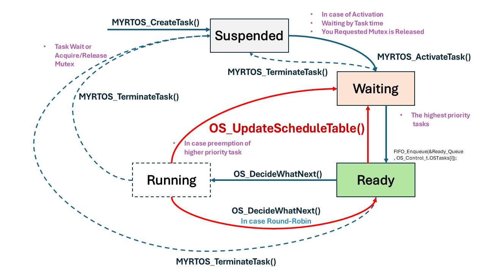
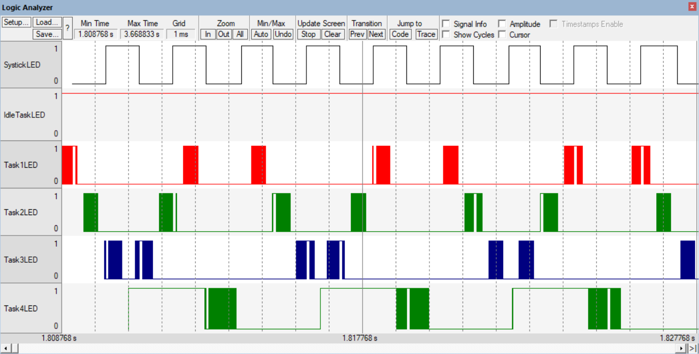
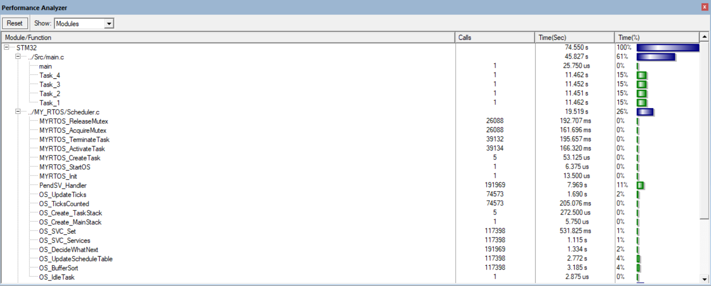

# My Own Custom RTOS for Cortex-M MCU

This project demonstrates a custom Real-Time Operating System (RTOS) designed for the ARM Cortex-M microcontroller series, specifically the STM32F103. The RTOS showcases a priority-based scheduling system with round-robin scheduling for tasks of equal priority, along with essential features like context switching and task management.

## Key Features

### RTOS Scheduler

The core of this RTOS is its **Scheduler**, implemented to provide efficient task management and scheduling:

- **Priority-Based Preemptive Scheduling**: Tasks are scheduled based on their priority, with higher-priority tasks preempting lower-priority ones.
- **Round-Robin Scheduling**: For tasks with the same priority, round-robin scheduling is implemented to ensure fair CPU time allocation.
- **Context Switching**: Efficient context switching is achieved using the ARM Cortex-M CMSIS (Cortex Microcontroller Software Interface Standard) to save and restore task states.
- **SysTick Timer Utilization**: The SysTick timer is configured to generate an interrupt every 1 ms, driving the scheduler to check the ready queue and perform task switching if necessary.
- **Task Switching Interval**: A configurable number of SysTick interrupts define the time slice for each task in the round-robin scheme.

### CMSIS and Porting

- **CMSIS Usage**: Leveraging the CMSIS library for Cortex-M, the RTOS interfaces directly with the ARM Cortex-M hardware to manage context switching and interrupts.
- **Portability**: The RTOS is designed to be portable across different Cortex-M microcontrollers by utilizing standard CMSIS functions.

### Implementation Details

- **`Scheduler.c`**: Contains the core scheduling logic, including context switching, SysTick configuration, and task management. It manages the ready queue, handles task preemption, and implements the round-robin scheduling logic for tasks of equal priority.
- **`Scheduler.h`**: Provides the user interface for interacting with the scheduler, including APIs for task creation, deletion, and inter-task communication.

## Task State Transition Diagram

The above diagram illustrates the various states a task can be in within the RTOS and the transitions between these states:

- **Suspended**: A task is in the suspended state after creation or termination. It remains in this state until it is activated.
- **Waiting**: A task enters the waiting state if it is blocked, such as waiting for a mutex to be released.
- **Ready**: Once a task is activated and ready to run, it is placed in the ready state, waiting for the scheduler to allocate CPU time.
- **Running**: When the scheduler selects a task for execution, it enters the running state. If preempted by a higher priority task or if it voluntarily yields (such as by waiting for a resource), it will move back to the ready or waiting state.

Key functions managing these transitions:
- **`OS_UpdateScheduleTable()`**: Responsible for updating the scheduling table, managing preemption, and ensuring the highest-priority task is selected to run.
- **`OS_DecideWhatNext()`**: Determines the next task to run, especially in round-robin scheduling scenarios.
- **`MYRTOS_CreateTask()`, `MYRTOS_TerminateTask()`, and `MYRTOS_ActivateTask()`**: API functions for task management, creating, terminating, and activating tasks, respectively.

## Project Structure

- **/MY_RTOS**: Contains source code files for the RTOS kernel, scheduler, and task management.
- **/MY_RTOS/Inc**: Header files defining task structures, priority definitions, and RTOS API.
- **/src**: Contains the main file source code for the current example.
- **/screenshot**: Contains visual representations of task scheduling, priority inversion, and task utilization scenarios.
- **README.md**: Project documentation and overview.

## Example Scenario: Priority Inversion

This RTOS example includes a scenario demonstrating **priority inversion**. Priority inversion occurs when a higher-priority task is blocked waiting for a resource held by a lower-priority task. Although this RTOS does not handle or mitigate priority inversion, it illustrates how it naturally occurs under specific conditions.

### Scenario Overview

1. **Task1** (Low Priority) starts execution and acquires a shared resource (mutex).
2. **Task2** (Medium Priority) runs but does not require the shared resource.
3. **Task3** (Medium-High Priority) becomes ready and preempts **Task2**.
4. **Task4** (High Priority) attempts to execute but is blocked because it needs the resource held by **Task1**.
5. **Task4** is moved to a suspended state, waiting for the resource to become available.
6. **Task3** resumes execution, as it has a higher priority than **Task2**.
7. Once **Task3** completes, **Task2** resumes and runs to completion.
8. **Task1** continues execution and eventually releases the resource.
9. **Task4** is reactivated and immediately preempts **Task1** to continue its execution.

### Key Observations

- **Priority Inversion**: During the scenario, **Task4** (highest priority) waits for **Task3** and **Task2** to finish so that **Task1** (lowest priority) can release the resource. This delay is a classic example of priority inversion.
- **Scheduler Behavior**: The scheduler efficiently switches tasks based on priority but does not address priority inversion, demonstrating the need for potential priority inheritance or ceiling protocols in real-world applications.

### Visual Representation

Refer to the screenshots for a detailed visual explanation:

-   
  **Screenshot1**: Shows the timeline of task execution, indicating when each task is scheduled, preempted, or blocked. It illustrates the priority inversion scenario where **Task4** (High Priority) is blocked by **Task1** (Low Priority) holding a resource.

-   
  **Screenshot2**: Displays the CPU utilization percentage for each task, providing insights into how much processing time each task consumes during the execution period.

## Conclusion

This custom RTOS provides a robust platform for real-time task management on Cortex-M microcontrollers, with a flexible scheduler and a clear demonstration of task priority dynamics. The example provided shows how priority inversion can affect task execution order and highlights areas for further development, such as implementing priority inheritance to handle such cases.
