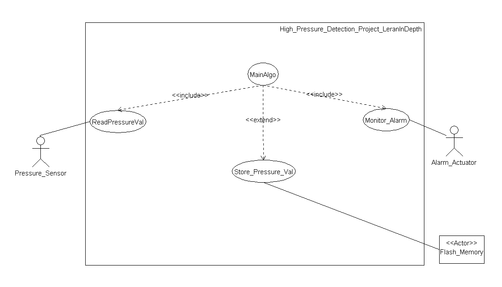
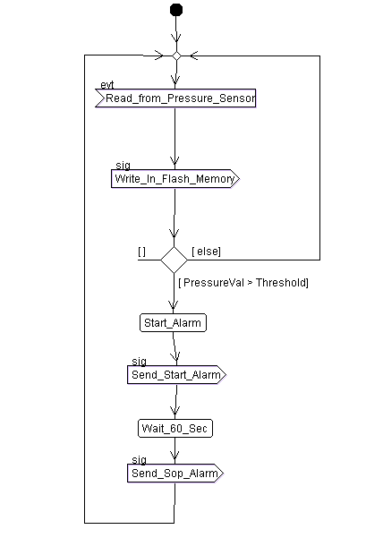
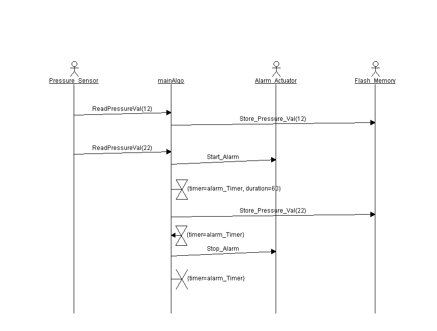
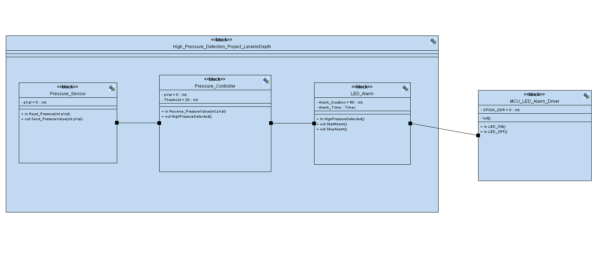
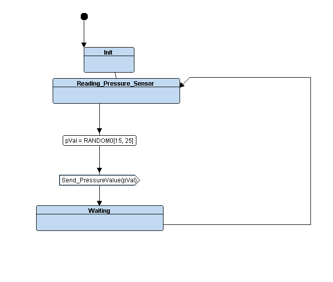
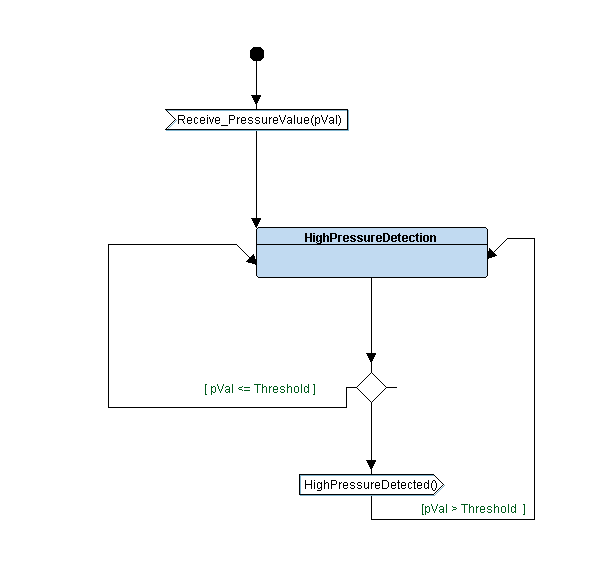
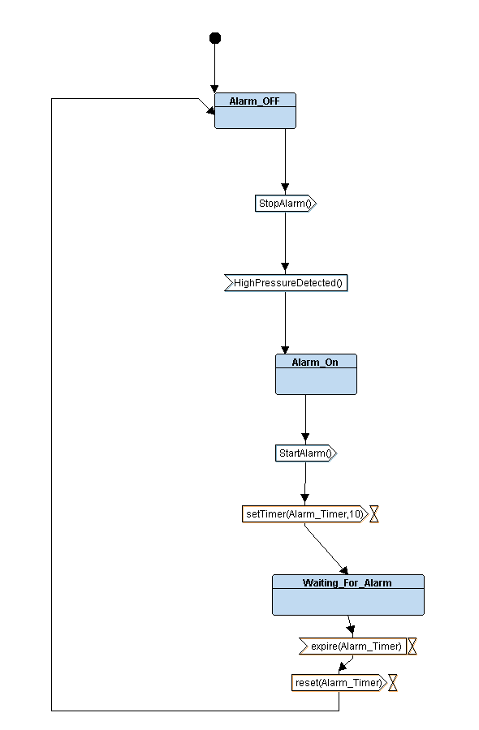
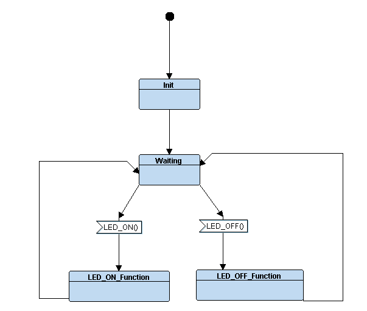
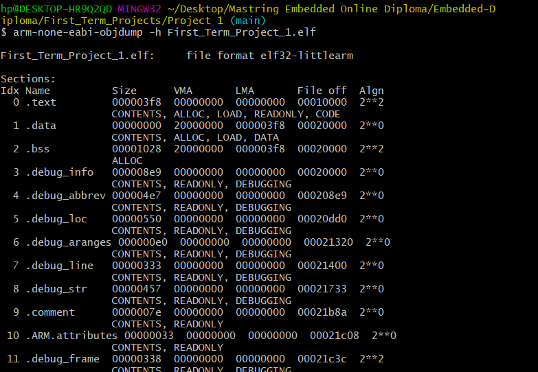

# Pressure Controller Project

This project implements a pressure controller system designed to alert the cabin crew when cabin pressure exceeds a specified limit of 20 bars. The project follows a systematic development approach, ensuring a reliable and accurate solution.

## Table of Contents
- [Project Overview](#project-overview)
- [Case Study](#case-study)
  - [Description](#description)
  - [Assumptions](#assumptions)
- [Methodology](#methodology)
- [System Analysis](#system-analysis)
  - [Requirements Diagram](#requirements-diagram)
  - [Use Case Diagram](#use-case-diagram)
  - [Activity Diagram](#activity-diagram)
  - [Sequence Diagram](#sequence-diagram)
- [System Design](#system-design)
  - [Block Diagram](#block-diagram)
  - [State Machine Diagrams](#state-machine-diagrams)
- [Code Data](#code-data)
  - [Memory Sections](#memory-sections)
  - [Symbol Table](#symbol-table)
- [Simulation](#simulation)
- [Conclusion](#conclusion)
- [References](#references)

## Project Overview
This pressure controller system is part of a study to explore a design that alerts cabin crew when the cabin pressure exceeds 20 bars. The alert system activates an alarm lasting 60 seconds when triggered. An optional feature includes keeping track of the measured values of pressure.

## Case Study

### Description
- The system alerts the cabin crew when the cabin pressure exceeds 20 bars.
- The alarm remains active for 60 seconds.
- Optional tracking of measured values is available but not included in the first version.

### Assumptions
1. The setup and shutdown procedures for the controller are not modeled.
2. Controller maintenance is not included.
3. The pressure sensor is assumed to be fail-safe.
4. The alarm is assumed to function without failure.
5. The controller is always powered and will periodically check the pressure sensor driver every second to optimize processor time usage.

## Methodology
The **Waterfall model** was selected for this project due to its structured and sequential phases, aligning with the client's well-defined requirements and minimal post-requirements customer involvement. This method provides a clear framework for risk management, regulatory compliance, and quality assurance.

## System Analysis

### Requirements Diagram

### Use Case Diagram

### Activity Diagram

### Sequence Diagram

## System Design

### Block Diagram

### State Machine Diagrams

1. ***Pressure Sensor***
   
2. **Pressure Controller**
   
3. **LED Alarm**
   
4. **LED Alarm Driver**
   

## Code Data

### Memory Sections

### Symbol Table
- **Symbol Table 1**
  
- **Symbol Table 2**
  

## Simulation

1. **Pressure = 15 < 20**
   
2. **Pressure = 31 > 20**
   

## Conclusion
This project report outlines the rationale behind the chosen approach for the pressure controller project, aligning with the project's specific requirements and ensuring a systematic and well-structured development process.

## References
For more detailed information on this project, including diagrams and code, please refer to the project's [GitHub repository](https://github.com/mohammedhassan9748/Embedded-Diploma/tree/main/Unit_5_First_Term_Projects/Project%201).

---

For more images and detailed breakdowns, you can explore the [ScreenShots](https://github.com/mohammedhassan9748/Embedded-Diploma/tree/main/Unit_5_First_Term_Projects/Project%201/ScreenShots) directory.
